# 平台经济案例分析

## 案例研究 —— 得物
- 
## 产品简介
得物App是一个**新一代潮流网购社区**，涵盖了正品潮流电商和潮流生活社区是平台的两大核心服务。
得物平台商品品类已经覆盖潮鞋、潮服潮搭、手表、配饰、潮玩、3C数码等。
作为年轻的潮流生活社区，得物App聚集了一大批*热爱球鞋、潮品穿搭和潮流文化的爱好者*，从而开拓了得物App社区+电商的商业模式。
得物App社区通过持续沉淀潮流话题内容，正在成为年轻用户的潮流风向标和发声阵地。
并且得物APP在传统电商模式的基础上**增加鉴别真假与查验瑕疵的服务**，首创“先鉴别，后发货”的购物流程，以“强中心化”的平台定位把控商品质量。基于此，保证用户在收到在得物App购买的商品前，该商品已经通过多道鉴别查验工序中的“层层关卡”，得到全面的查验鉴别，为用户提供“多重鉴别，正品保障”的全新网购体验。
- 平台发展阶段：成熟期
- 平台定位：年轻潮流的消费人群
- 主要价值：新一代潮流网购社区
## 市场分析
- 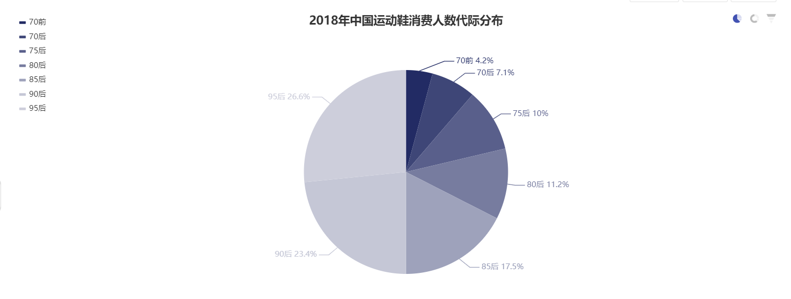
- 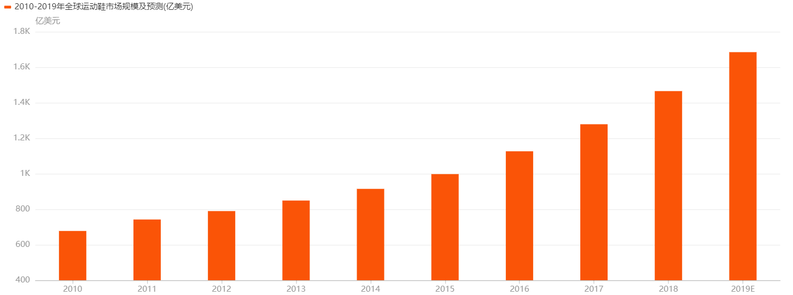
- 鞋服是人们必不可少的东西，随着时代发展，人们生活品质提高，对衣物，鞋子的要求也不简简单单的是遮羞布，好看和吸引眼球成了新需求，这也促进了对潮流鞋服的消费，在互联网时代，线上消费也早已成为消费的主战场。线下的获取球鞋、潮服的渠道单一，并且货量少，除部分一线城市有线下专卖店发售，其他地区城市的消费者要线下购物成本高，无法面向全国各地的用户，因此线上的发展成为主要趋势。
- 但是线上的购物网站渠道消费者担心买到假货，消费者需要一个在行业有威信，能够给消费者承诺的平台。
- 所以得物App顺势而行，正品保真鉴定服务的推出，以及C2C模式解决了消费者对当下市场“求购无门”的窘境。
- 得物一开始主打的是潮鞋，在后期发展中才渐渐向潮服潮搭、手表配饰、潮玩等等方面拓宽业务，我们可以看到从全球或国内鞋品的市场规模可见，人们对于潮鞋的需求越发增长，全球鞋品市场规模也越发庞大，并且国内运动鞋主要消费人群为90、95后这部分的年轻群体，所以得物App的推出，迎合了当今市场需求。
- 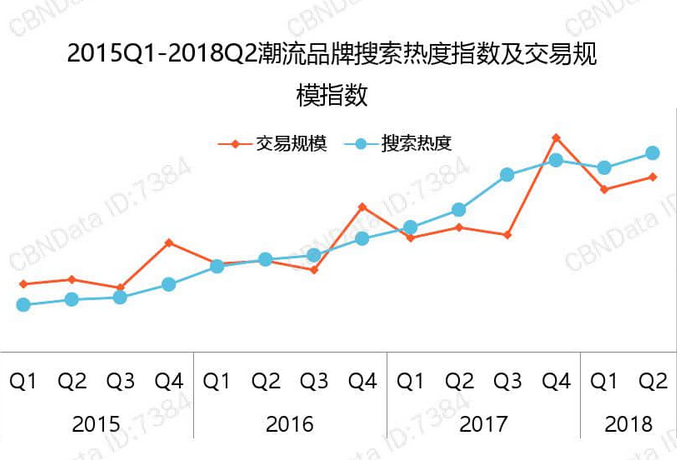
- 在2015年至2017年，全球潮流产品的市场规模持续快速增长，2017年对比2015年，潮流商品的全球销售额实现了翻倍增长（2017年为2000亿美金，2015年为900亿美金），2017年潮流品牌的增速规模为非潮牌的三倍以上。
- 宏观上看，整个潮流品牌的消费市场潜力巨大；对于得物而言，垂直化的电商模式主要依靠的就是客户群体的消费水平，潮牌市场的良性发展和产品特性也必然促进二级交易市场快速发展。
- 得物作为国内潮牌交易的B端中间商平台，利用资源整合作为盈利模式，既能有效规避市场风险，又能享受潮牌市场的红利；此外每当冬季来临时，潮牌的销售增速最高，是相关产业盈利的年红利期，得物也可以将其作为营销的重点时期。
## 目标用户分析
### 用户分析
- 得物App主要用户群：年轻潮品爱好、消费者
- 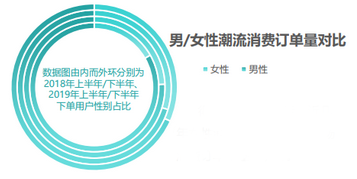
- 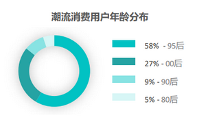
- 潮牌的主要人群正在偏向于新生代（95后、00后），针对性的设计产品才能抓住关键用户的实际需求；新时代消费者更加注重个性化，体验化，对产品的品质具有较为苛刻的需求；此外女性用户的占比逐渐提升，现阶段男女比例约为：3：1。
- 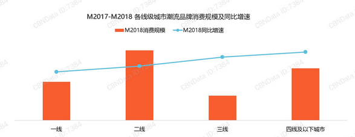
- 潮流品牌的主战场为一二线城市，贡献了70%以上的消费占比，但在增速上不及三线及以下城市；一定层面上反应了一二线城市的潮牌商品的消费水平趋于饱和，需求着力点正向三线及以下城市转变。
### 用户行为
- 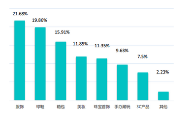
- 潮牌用户除服饰外，对球鞋、箱包也具有较高的关注度，而潮玩配饰的关注度较接近；总体来看潮流商品的总类丰富，潮流爱好者对于不同品类的潮流产品都具有一定的购买欲望。
- 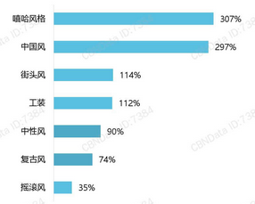
- 潮牌用户对于嘻哈风、中国风的喜好变化最大，中国风的崛起也反映着国潮的迅速发展；此外潮流用户的风格多元，嘻哈文化、街头文化仍为潮流文化的先锋。
### 用户画像
- 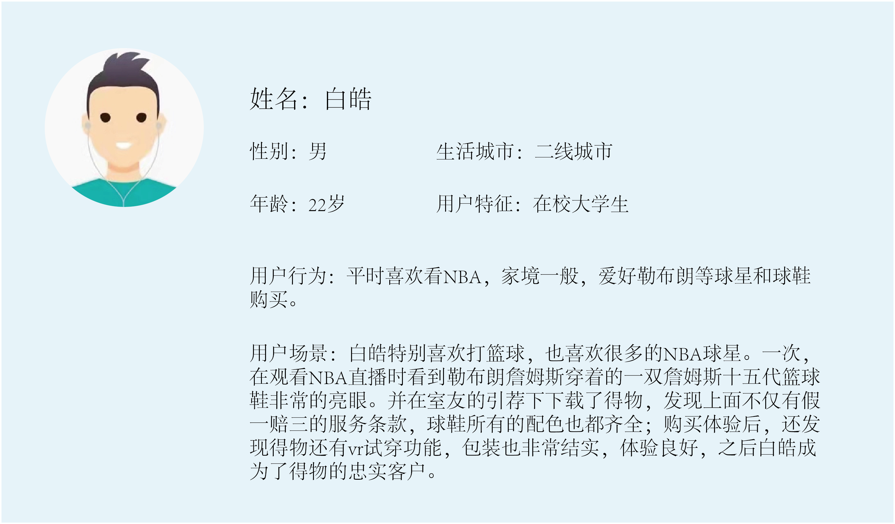
- 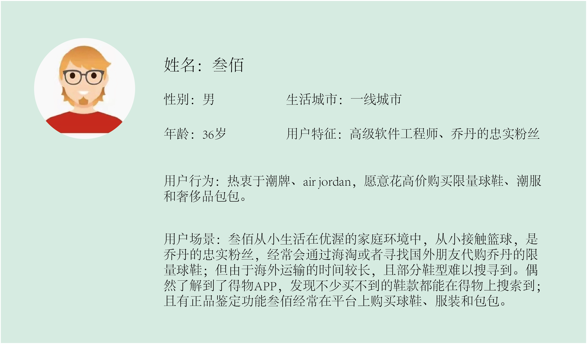
- 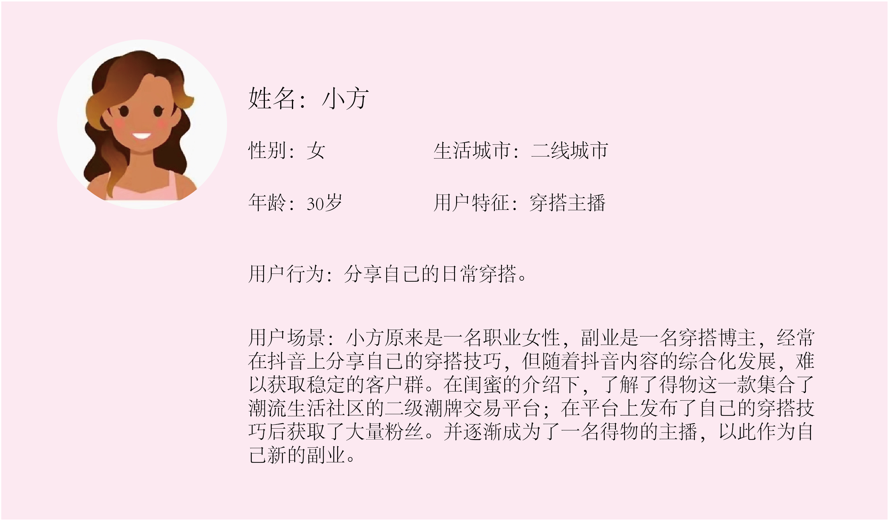
- 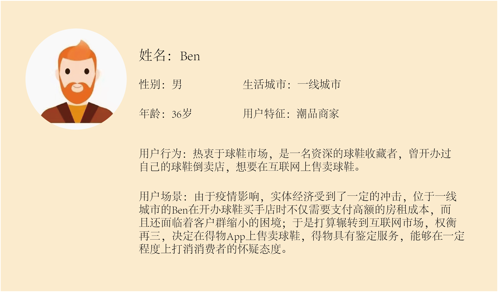
### 产品分析
- 得物 VS 识货 VS nice
- 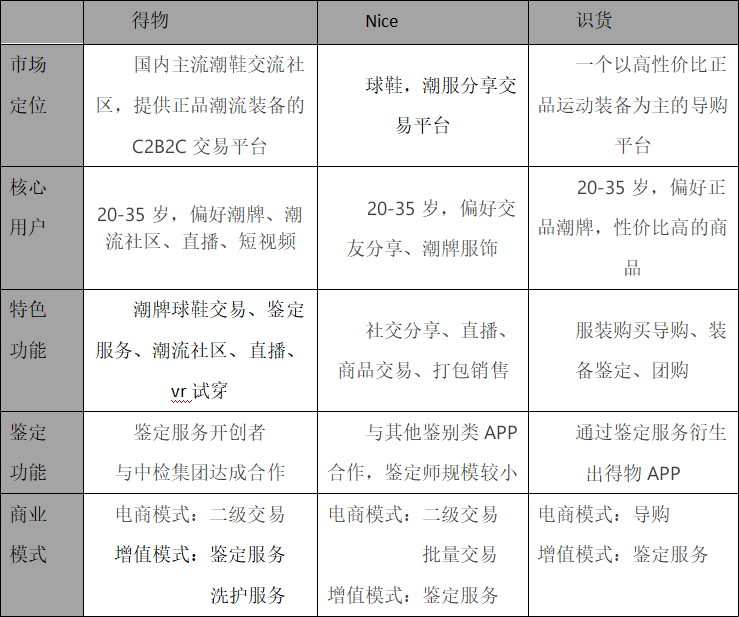

---

## A-1. 平台理论 
### 1.1 市场失灵与治理
- （1）市场失灵的治理策略：
> 良好的治理对于国家和平台商业来说都是非常重要的，因为在绝对自由市场经济环境下，人和组织的互动如果没有规则、限制或保障措施的话，不会产生公正和令人满意的结果，市场也是如此，称之为“市场失灵”。而良好的治理有助于减轻或防止市场失灵。
- （2）市场失灵的主要原因：
> 信息不对称（information asymmetry）、外部效应（externalities）、垄断（monopoly power）和风险（risk）。
- （3）市场失灵治理的几大原则：
>①内部透明化（internal transparency）。
>在平台中的公司，部门都有一种“孤立化”的倾向，拥有独特的视角、语言、系统、流程以及工具，这会导致解决跨越两个或者多个部门的复杂的、大规模的问题时非常困难，因为不同的工作团队缺乏共同语言或者工具集。这也会使包括平台用户和开发者在内的外在人员很难与平台的管理团队共同开展有效的工作。
>为了避免这种机能失调，平台管理者应该努力给跨平台的所有业务部门一个明确而透明的观点。这种透明度能够促进一致性，帮助他人开发和使用关键的资源，并促进规模增长。
>②参与度（participation）。
>在内部决策过程中，平台管理者给予外部合作伙伴和利益相关者的话语权应当等同于内部利益相关者。
- （4）平台治理的基本工具：
>包括法律、规范、体系结构和市场。
>为了鼓励平台参与者积极参与，产生良好的互动，抑制不良的互动，每个工具必须小心设计和应用。
### 1.2 微型市场策略
> 起初，锁定有成员正准备参与互动的小市场。这样，平台即便在最初发展时，也能为 大市场提供有效的匹配特征。
### 1.3 培养创新，抓住价值
> 平台的开放性质为用户创造了无数个创造新价值的机会。平台管理者可以通过首先为合作伙伴提供顺畅的创新机会，然后抓住通过收购或复制产生的部分或全部价值，从而发展自身业务。从长远看，控制其生态系统中由用户和为用户创造的主要资源对于平台管理者自身是有利的。
### 1.4 核心交互有三个关键要素
**参与者 + 价值单元 + 过滤器 = 核心交互**
| 参与者（participants） | 价值单元（valce unit） | 过滤器（filter）|
| ----------- | ----------- | ----------- |
| 核心交互的根本参与者就是两种人：创造价值的生产者和使用价值的消费者。      | 每个交互都是以那些对用户有利的信息的交换开始的。因此，几乎每个核心交互的开端都是生产者对于价值单元的创造。      |价值单元是经过过滤器处理后传递给特定消费者的。过滤器是有着严格算法、以软件为基础 的工具，平台会用它来完成用户间适当价值单元的交换。|

## A-2. 平台中国案例分析成果
### 2.1 市场失灵与治理：
- 随着2017年始说唱文化和潮流运动在中国兴起，各类结合嘻哈文化的球鞋运动受到年轻一族的喜爱。从实用价值到审美价值到收藏价值，球鞋也被赋予了更多的时尚运动的价值观念与意义。但这也导致了球鞋市场供需开始失衡，一方面，许多线下的品牌专卖店代购通宵排队，球鞋恶意转卖，价格水涨船高的乱象迭起。另一方面，缺乏诚信理念的不良商家生产大量高仿假冒的球鞋进入球鞋市场流通，利用买卖双方的信息不对称牟取暴利，导致市场进一步失控。
- 此时，球鞋市场用户亟需解决的痛点是:
>（1）合理的平台治理干预，解决一鞋难买难抢的市场僵局；
>（2）专业的球鞋鉴定服务，让用户的交易更有保证更加安心。
- 得物设计提供专业鉴定服务与垂直耕耘潮鞋的功能板块，针对市场失灵，得物遵循平台的参与度原则，公开了得物线下球鞋鉴别查验的全部流程，覆盖了从收货，到尺码标，拉帮线，鞋垫刷胶，刺绣工艺等的全面质检，以及专属防伪扣，配套鉴别证书等防伪细节。同时加强平台内部的治理，明确规范，加强平台自身的球鞋鉴别师的职业道德素养与专业精神，为用户提供更优质的服务。

### 2.2 微型市场策略：
- 随着互联网的发展普及，人民审美水平也在逐步提升，对于多元化的元素有着更包容的态度，在多文化交融背景下成长的90、千玺一代也正在成为潮流时尚文化的新兴主力军，他们不仅有着超强的购买力，更有着更加个性化的消费特征：这部分群体除存在希望电商平台购买模式更加垂直化，的小众需求，也乐于尝试新鲜事物，外显属性、社交属性成为他们他们决策消费的动力之一。
- 聚焦于这类热爱潮流运动文化的小众用户，得物聚焦于目标用户人群的消费喜好选择平台主营商品，截止目前，得物APP的商品已经覆盖潮鞋、潮服潮搭、手表、配饰、潮玩、3C数码、家居家电、美妆等。
- 除商品的选购以外，结合得物APP的发展历程也能观察得出得物在聚焦微型用户市场做的一番功夫：自得物APP成立起，便一直将年轻人作为主要服务对象。2015年，得物App初版以资讯App上线，帮助年轻人了解球鞋文化和潮流资讯；随后，得物App专注打造国内主流Sneaker互动社区；2017年，基于对潮流文化的了解和对年轻人的消费洞察，得物App上线交易功能。
- 而在商品营销方面，得物APP也针对这部分用户存在的消费求异性，外显属性、社交属性的消费心理，推出了明星潮牌入驻并将得物APP作为独家首发渠道的营销战略。仅今年6月，平台新上架超过400个品牌的近万款潮流商品，其中将近100款商品为全球独家首发。
- 截止目前，得物App上聚集了大量年轻的消费人群，其中90后电商主力消费人群占比超过75%，覆盖一线城市、沿海地区，广泛分布于全国，这彰显了得物APP的微型市场战略的前瞻性。而得物APP也从原名为“毒”的APP正式更名为“得物”。相较于“毒”而言，“得物”品牌形象更加清晰，更具功能指向性，也就更容易获得“破圈”后的主流群体组成的流量，预示了得物APP从微型市场逐步辐射到主流市场的战略决心。

### 2.3 培养创新，抓住价值
- 与淘宝的“门类齐全”，与拼多多的“物美价廉”相比较，得物的关键词是“小众品质”。得物聚焦于90后、00后等热衷于新型运动潮流文化与嘻哈音乐的年轻消费族群，将垂直电商的创新发挥得淋漓尽致。除得物APP的球鞋鉴定+球鞋潮流资讯生活社区的产品定位本身具备创新以外，得物的内部功能细节设计也无一不体现了创新：
> （1）VR试鞋：VR试鞋让用户可以通过手机实时观看尝试自己喜欢的鞋子以及上脚的动态效果，为用户提供更直观的购买参考；
> （2）利用3D扫描技术建立了全球最大的“3D球鞋全息空间”，通过采集商品3D全息信息，用户在浏览商品时能够720度无死角查看单品的细节，从而对心仪的商品拥有更全面生动的感知。
> （3）上线国潮专题，为国潮文化助力：在该专题下汇集回力、飞跃、李宁、安踏等中国实力品牌的热门鞋款，平台还着力在社区内部通过话题引导，文章推送等引导用户关注国潮品牌的内涵故事，让年轻人感悟中国老品牌的魅力。
> （4）防伪包装升级，防伪性能与审美性能兼具：在原有防伪扣的基础上增加了经过近千次香氛测试及迭代的植物香型，并且搭载全新夜光科技，给用户带来从体感到观感全方位体验升级

### 2.4 核心交互的三个关键
>（1）参与者：
>①特殊用户：潮流球鞋品牌，视频内容创作和分享的得物生活社区博主、鉴别师；
>②普通用户：购买商品的用户，观看直播的用户，观看视频的用户，想要鉴别商品真假的用户等；
>（2）价值单元：一次球鞋交易，一个潮流球鞋推广的视频，一次直播，一次球鞋鉴别/球鞋洗护服务； 
>（3）过滤器：依据用户喜好进行的算法推荐（依据足迹，收藏，浏览记录）；用户主动发起的搜索请求。

## A-3. 平台中国案例建议
### 3.1 平台治理：
1. 加强鉴定功能
- 针对问题：
> 提供正品、便宜的商品是它吸引用户的主要功能，核心功能需要长期保持并发展下去。但根据大量用户反馈，在“得物”上买到了假货，作为一个保真平台出现大量假货问题，平台需要进行深刻的反思和改革。
- 问题建议：
>（1）提升商品鉴定功能，保证商品质量、正品，对恶意抬高商品价格的情况严加监管。
>（2）增加审核、鉴定人员，并设立统一审核标准，提供惩罚机制。

2. 平台用户信任成本
- 针对问题：
> 得物App的产品展示样式更接近于“传统电商平台”而非“二交易平台”，并且辅以平台保证保障等信息，从而使得用户更多的以为得物App是一个“B to C电商平台”。这么做的好处是减少用户购买决策成本，但是却提高了用户信任成本以及降低了售后客服效率，从而需要增加更多售后客服人员。
- 问题建议：
>（1）降低用户预期，明确平台身份，使用户清楚区分平台和卖家，增加用户对平台的信任度，并且增加用户自审的环节，能减少售后客服的压力。
>（2）优先出售“有资质”的商家商品，减少个人商品出货量，并且提供个人卖家的商品展示页面。

3. 提高“穿搭精选”的内容质量
- 针对问题：
> 大部分年轻人是有穿搭需求而对穿搭不明，所以穿搭精选可以给予用户比较明确的风格建议，从而增加购买意愿，因此穿搭精选对于用户的重要性而言是非常大的。得物App提供的穿搭精选是从用户动态中抽离提取出来的，而用户发动态多是为了晒，并没有提供“穿搭”，这是期望与结果产生了冲突。
- 问题建议：
> 允许用户主动投稿，并在用户发布动态页面增加投稿功能，提供投稿模板，投稿后将在该商品详情页展示。为有意向成为KOL的普通用户累计粉丝，而对于现有KOL而言也可以大幅增加自己的曝光机会。

### 3.2 平台策略：
1.	大学校园地推拉新
> 得物的目标用户以年轻人为主。大学设立诸多社团，可以考虑赞助学校社团举办比赛、活动，在大学生群体中提高自身的知名度，发掘潜在用户。
2.	社交电商
> 着重培养优质的独立创作人，推出有底蕴、有内涵知识的帖子。将KOL与电商相结合，做到消费沉浸化，让用户在不知不觉中，舒适的、自如的完成消费。通过算法加推和数据支撑，为用户推荐出最适宜其的KOL和产品。让用户在闲逛中下单，消费生活化。
3.	规范推送策略
> 设立推送规范，每周APP的消息推送不能太频繁，不然用户可能会因为低质量的推送从而关闭得物App的通知权限。优惠消息、福利可以在微博、公众号发放，减少APP消息推送。

## B-1. 大数据理论
### 1.1 大数据理论-更好的数据：不是因果关系，而是相关关系
- 通过应用相关关系，我们可以比以前更容易、更快捷、更清楚地分析事物。相关关系通过识别有用的关联物来帮助我们分析一个现象，而不是 通过揭示其内部的运作机制，推荐系统就是很好的一个例子。得物平台根据用户数据废气，获取用户的浏览记录、订单记录，通过大数据相关关系分析得出用户的购买偏好，在首页为用户推送符合用户偏好的商品。
### 2.2 大数据理论-数据价值--数据创新（可扩展数据）
- 促进数据再利用的方法之一是从一开始就设计好它的可扩展性。收集多歌数据流或每个数据流中更多的数据点的额外成本往往较低，因此收集尽可能多的数据并在一开始的时候就考虑到各种潜在的二次用途并使其巨有扩展性是非常有意义的，如果以某种方式收集的单一数据集有多种不同的用途，它就巨多双重功能。得物通过用户长久以来的浏览、订单数据为用户个性化推荐符合偏好的商品，这种推动的数据运用和算法都跟市面上的购物平台大同小异，而得物有另外的推送算法，将那些较偏门又好评率较高的的商品推送给用户，让这小部分没被大数据发掘出来的好商品收到关注，扩展了数据的价值，改变了单一数据集的用途
### 2.3 大数据理论-当沟通变成数据
- 社交网络平台不仅给我们提供了寻找和维持朋友、同事关系的场所，也将我们日常生活的无形元素提取出来，再转化为可作新用途的数据，实现人们想法、情绪和沟通的数据化。有时还会使用一项叫作情感分析的技术，以获得用户反馈意见的汇总或对营销活动的效果进行判断。数据化不仅能将态度和情绪转变为一种可分析的形式，也可能转化人类的行为。将行为与沟通进行分析，可能会产生以往预料不到的联系。在得物的社区页面系统将会通过大数据分析，把评论区最火爆的商品的相关帖子置顶在社区页面，利用用户紧追潮流的心理，让商品在社区进一步扩大影响力从而提高销量。
### 2.4 大数据理论 -更杂：不是精确性，而是混杂性
- 执迷于精确性是信息缺乏时代和模拟时代的产物。只有5%的数据是结构化且能适用于传统数据库的。如果不能接受混乱，剩下的95%的非结构化数据都无法被利用，只有接受不精确性我们才能打开一扇从未涉足的世界的窗户。得物平台与多个品牌进行合作加盟，相当于接受了更多的数据，增加了为用户推送的商品种类，提高了用户留存率

## B-2. 大数据中国案例分析成果
### 2.1 更好的利用数据：研究数据之间的相关性
- 在小数据世界中，相关关系是十分有用的，但在大数据的背景下，相关关系大放异彩。通过应用相关关系，我们可以比以前更容易、更快捷、更清楚地分析事物。其中说的相关关系，即是当一个数据值增加时，另一个数据值很有可能也会随之增加。得物app在每一个商品介绍页面中都加入了“相关推荐”，将其数据研究中有相关关系的商品在此展示，增加用户连带购买的几率，从而刺激消费。正如沃尔玛的成功案例，即沃尔玛在研究出飓风现象出现时，蛋挞的销量会连带增长这个现象后，将蛋挞与飓风用户摆放在一起，促进了销量的增加，得物此设计正促进了其商品的销售。
 
### 2.2 更多数据的利用：进行数据价值挖掘以及数据创新
- 我们身处大数据时代，大数据为我们提供了许多机会，“让数据发声”是我们在这个时代应该做的事情，让更多数据“发声”也是我们应该做的事情，所以得物app对此做出的正是“利用所有的数据，而不仅仅依靠一小部分数据”。由此得物app利用平台中获取到的所有的数据，如：用户购买记录、用户浏览记录、用户点赞关注记录等等数据结合，推出“推荐”“相关推荐”功能，为用户提供更个性化的推荐，让用户看到的内容更符合自己的需求和喜好。利用所有数据为用户推出个性化服务是得物平台意识到身处大数据风口中做出的与传统非数据化平台的改变。并且利用数据进行功能创新，如导入鞋品3D数据，推出商品3D全息空间，提供鞋品3D试穿功能，进行了功能创新
 
### 2.3 利用“社区”数据，让沟通的数据更有可利用性
- 得物app的产品定位是集正品潮流装备交易、鉴别、潮流生活于一体的新一代潮流网购社区，实质上的性质是社区+电商模式，所以本平台会产品大量的“社区”数据，用户在平台当中沟通、交互留下的痕迹能够很好的利用起来，作为有用数据，为进行了平台优化。得物根据用户集体最近常看常交流的商品类型或者商品进行打折，推出活动等等，促进销量，更合理全面的利用数据，让沟通产生的数据更有可利用性
 
### 2.4 大数据的风口，容纳更杂的数据，实现管理模式的变革
- 面对如此热烈的大数据风口，得物平台利用数据推出了计算机识别、AI辅助等功能，对于平台潮品提供了潮品验真服务，此服务也成为了得物app的一大特色，但是此服务也“翻车”过，近年得物平台因潮品验真服务爆出的负面新闻已有不少，未来得物app的发展因此也应有思考和调整，得物app已经在利用更多更杂的数据对自身平台的AI、机器学习进行优化。

## B-3. 大数据中国案例建议
### 3.1 加深相关关系的联系
- 用户在不同时期的需求不一样，推荐页的内容应该通过不同时期的需求进行个性化调整，同时用户进入平台的一级页面也应让用户自己决定，部分用户为了购买商品进入平台而一级界面并不是购买界面，需要进行二次操作。因此应进一步思考其相关关系的联系——加深个性化服务。

### 3.2 开拓新的数据来源
- 得物APP作为用户购买以及销售的中间商，为了能保证稳定的货源以及质量，应该寻求更为可靠的供应商，进而开拓新的数据来源，例如一些得物新开拓了邻域，大牌彩妆类，汽车，家装等等方面，都应该与其达成有效合作。吸引更多品牌商家入驻，并达成长期的合作关系，以及打折力度的独家，让品牌质量得到保障，让用户能更无忧的从平台购入商品。从而进一步严控了商品质量。

### 3.3 注重沟通的数据，量化一切数据。
- 一切数据皆可量化，当文字变成数据，它就大显神通了——人可以用之阅读，机器也可用之分析。“现实挖掘”这里指的是通过处理大量来自手机的数据，发现和预测人类行为。有了大数据的帮助，我们不会再将世界看作是一连串我们认为或是自然或是社会现象的事件，我们会意识到本质上世界是由信息构成的。通过量化的沟通预测用户会喜爱的商品，进而以强大的数据库为依靠，向用户推荐商品。利用数据来建立营销活动、提高用户留存率等，可能吸引到更多的用户。

### 3.4 管理变革
- 让数据的使用者承担责任，用户没有理由为这些假冒伪劣商品买单，当得物APP出现了假冒伪劣商品、贩卖以次充好的产品等违规行为，国家工商部门可以对其进行处罚，得物APP要对自己监管不到位付出相应的代价，并且从细节落实，例如提升鉴定师的鉴定能力，对于卖家的信誉要打分，一旦出现问题，立即拉进“失信名单”，不再让其在平台售卖商品等。同时让售卖假冒伪劣的用户为自己的行为买单。由此得物应该进一步监管好平台上售卖的商品，不能失信于用户。

### 3.5 从容易被忽略的地方提取数据，寻找数据的潜在价值
- 可以发现许多发明创新的应用，其实都应用了许多我们平时忽略的数据，许多数据正是都存在于不可思议的地方，如：得物可以思考从用户使用某交互与最总达成交互目的的过程中，有多少的无效交互，从而分析自身产品的交互有效性，优化得物平台的交互；

## C. 大数据及平台两论点的整合度
- 得物以资讯形势打开潮流市场，作为球鞋文化以及潮流资讯为主线的资讯APP存在。2017年开始上线交易模式，除了延续潮流资讯的社区类APP形式之外更是增加了自主专业鉴别功能。社区和交易平台的模式吸引了越来越多的年轻用户，以打造球鞋爱好者的交流社区和球鞋鉴定，与淘宝和拼多多作出区别，帮助用户识别产品真伪，得到年轻人的喜爱和追捧。
- 从大数据的角度来看，得物利用平台中获取到的所有的数据结合，推出“推荐”“相关推荐”功能，为用户提供更个性化的推荐，让用户看到的内容更符合自己的需求和喜好，这是得物平台意识到身处大数据风口中做出的与传统非数据化平台的改变。得物在每一个商品介绍页面中都加入了“相关推荐”，将其数据研究中有相关关系的商品在此展示，增加用户连带购买的几率，从而刺激了消费。得物中每个商品都有“最近购买”的数据展示区，提供了比价服务，用户能够更加方便的考虑购入时间，这为用户提供了便利，也让此数据更具有可利用性。面对如此热烈的大数据风口，得物平台利用数据推出了计算机识别、AI辅助等功能，虽然这些功能偶有“翻车”，但这也是得物的发展应该思考和调整的方向。
- 对得物的建议：提供正品、便宜的商品是得物吸引用户的主要功能，对于出现假货的现象，平台需要进行深刻的反思和改革；保证金对于新用户来说，容易造成心理顾虑从而流失一部分用户；售后服务也应该更加公开透明化。当得物APP出现了违规行为，国家工商部门可以对其进行处罚，得物APP要对自己监管不到位付出相应的代价，也应该进一步监管好平台上售卖的商品，不能失信于用户。为了能保证稳定的货源以及质量，应该寻求更为可靠的供应商，进而开拓新的数据来源。吸引更多品牌商家入驻，并达成长期的合作关系。注重沟通的数据，量化一切数据，以强大的数据库为依靠，向用户推荐商品。利用数据来建立营销活动、提高用户留存率等，可能吸引到更多的用户。在产品设计上，应进一步思考用户需求，方便每个用户操作，加深个性化服务。从容易被忽略的地方提取数据，寻找数据的潜在价值可以发现许多发明创新的应用。